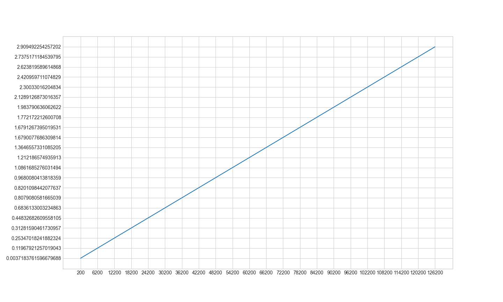

# semester-project-median-of-medians-qsort

[](../../actions/workflows/cmake.yml)

_Quick Sort - один из самых быстрых известных универсальных алгоритмов сортировки массивов: 
в среднем O(n) обменов при упорядочении n элементов; из-за наличия ряда недостатков на практике обычно используется с некоторыми доработками._

## Меместрои

Группа: 11-104

| Фамилия Имя      |    Вклад (%) |     Прозвище |
|:-----------------|-------------:|-------------:|
| Евстратова Дарья |    Меместрои |       _босс_ |
| Новак Сергей     |       Строят |    _Серджей_ |
| Липперт Марк     |       Вместе |        _бот_ |
| Талова Олеся     |            И |      _олеся_ |
| Шакуров Амир     | В протесте!! | _Shakur(ik)_ |

**Девиз команды**
> _Доброе утро! И на случай, если мы вас больше не увидим — добрый день, добрый вечер и доброй ночи!_

## Структура проекта

- [`src`](src) - реализация qsort;
- [`analytics`](analytics) - контрольные тесты производительности qsort;
- [`tests`](tests) - наборы данных для запуска контрольных тестов и их генерация;

## Требования

Рекомендуемые требования:

1. С++ компилятор c поддержкой стандарта C++17 (например, _GNU GCC 8.1.x_ и выше).
2. Система автоматизации сборки _CMake_ (версия _3.12.x_ и выше).
3. Интерпретатор _Python_ (версия _3.7.x_ и выше).
4. Рекомендуемый объем оперативной памяти - не менее 4 ГБ.
5. Свободное дисковое пространство объемом ~ 1 ГБ (для входного набора данных).

## Сборка и запуск

#### Сборка проекта

Склонируйте проект к себе на устройство через [Git for Windows](https://gitforwindows.org/) (либо используйте
возможности среды разработки):

```shell
git clone --recurse-submodules https://github.com/lippertmark/semester-project-median-of-medians-qsort.git
```
Сборка и запуск проекта осуществляется через среду разработки.
_Откройте проект, запустите файл src/quick_sort.py для просмотра работы декартового дерева._

_Запустите tests/test_sort.py для проверки правильности работы кода._

####Контрольные тесты (data)
_Для запуска анализа времени работы программы нужно запустить analytics/analytics_qsort.py_
#### Генерация тестовых данных

_Формат данных: [txt](https://ru.wikipedia.org/wiki/%D0%A2%D0%B5%D0%BA%D1%81%D1%82%D0%BE%D0%B2%D1%8B%D0%B9_%D1%84%D0%B0%D0%B9%D0%BB)._
_Данные генерируются с помощью функций numpy.random.randint()_

##### Список контрольных тестов

| Название                      | Описание                  | Метрики |
|:------------------------------|---------------------------|:--------|
| `check_sort`                  | сортировка из n элементов | _время_ |

_Результаты измерений представлены в файлах analytic_Sort.txt_


_check_sort_
## Источники

_Список использованных при реализации структуры данных источников._

_[Википедия](https://ru.wikipedia.org/wiki/%D0%91%D1%8B%D1%81%D1%82%D1%80%D0%B0%D1%8F_%D1%81%D0%BE%D1%80%D1%82%D0%B8%D1%80%D0%BE%D0%B2%D0%BA%D0%B0)_

